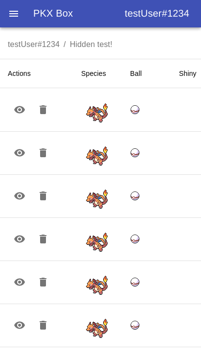

# PKX-Box

A WIP [Porybox](https://www.porybox.com/#/) style website. This also has examples for some fun concepts that can be used during development.

## Project Structure

This project is a mono-repo consisting of multiple other projects, which either have or may get pulled into their own repos at some point:

- PKHeX.Core-Lambda - submodule for the PKHeX-Lambda project that allows running a microservice to parse and optionally sign a PKX file
- PKHeX.Core-Lambda-proxy - a quick and dirty script to mimic an API Gateway. This allows running PKHeX.Core-Lambda in a lambda docker container, and hitting it as a REST API, just like its intended production use
- discord-jwt - lambda function to be setup behind an API gateway. It works with Discord OAuth to set a JWT cookie after a user logs in with discord
- pkx-box-lambda - GraphQL lambda function to power the web app that uses Firestore as a database
- web-app - pkx-box web app using React, Apollo, Material-UI, storybook, among other tools

Each directory has its own readme which contains more information about each project.

## Running locally

Local development is accomplished with Docker. Docker-compose is used to orchestrate the different services so one command brings up everything needed for development.

The PKHeX-Lambda container runs using an image [that aims to closely mimic lambda](https://hub.docker.com/r/lambci/lambda/) to try and replicate production locally.

At the moment, the only thing that isn't run locally is a firebase emulator. If this gets added, the platform could be developed completely offline.

### Prerequisites

#### Build PKHeX-Lambda

A prerequisite to running this project locally is needing to build and unzip the PKHeX-Lambda service. This can be done by:

1. Following the readme instructions to create the build
2. Unzip the release zip into an `unzipped` directory - i.e. `unzip deploy-package.zip -d unzipped`

In the future, this process should happen automatically.

#### Provide environment variables

Every service has its own set of environment variables that are needed to run this platform. Look through each readme to see the environment variables required for each service.

The exception is PKHeX.Core-Lambda, since we're configuring the lambda emulator, not the submodule. Default configuration is provided in the `docker-compose.yml` file.

Aside from the web app and PKHeX.Core-Lambda, the other services will need a `.env` file located in their specific directory with the environment variables. Each environment variable should be on a new line with the format being `VARIABLE_NAME=value`.

For example:

```
API_URL=http://localhost:5000/
WEB_APP_URL=http://localhost:5001/
```

### Starting the orchestration

Run `docker-compose up` to start the different services.

### Docker Stubs

Many projects often need authorization and authentication, and we don't want to have to deal with this during development. Coding 'dev hacks' to check if the current code is running in a development environment brings security concerns, and makes the code not safe to deploy.

Since this project runs locally in docker, we can utilize mounting specific files from the host machine to the container that stub out pieces of functionality.

For example, normally `pkx-box-lambda` will use a JWT to determine a user's username, id, etc. This enables the lambda to know who the user is, and see if they're authorized to make certain requests. With docker, we can stub out the logic that checks for a JWT, and have the code think a user is always logged in.

Since the stub files are isolated from the lambda code and are only used in local containers, there's no fear of deploying any dev hacks, and we don't have to worry about auth locally.

Another use for this is replacing the code that exports the lambda handler with code telling the services to listen on specific ports.

## Architecture

Intended architecture:


## Screenshots




